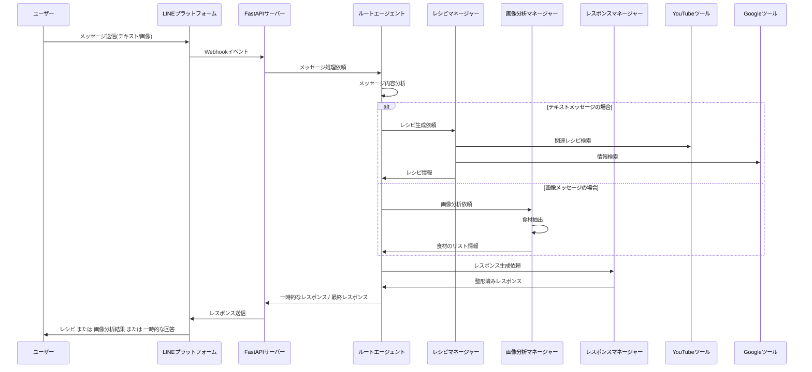
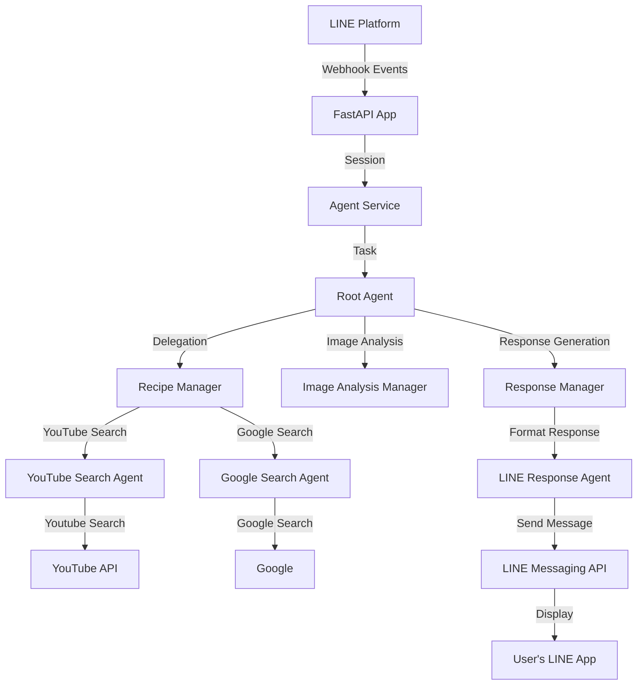
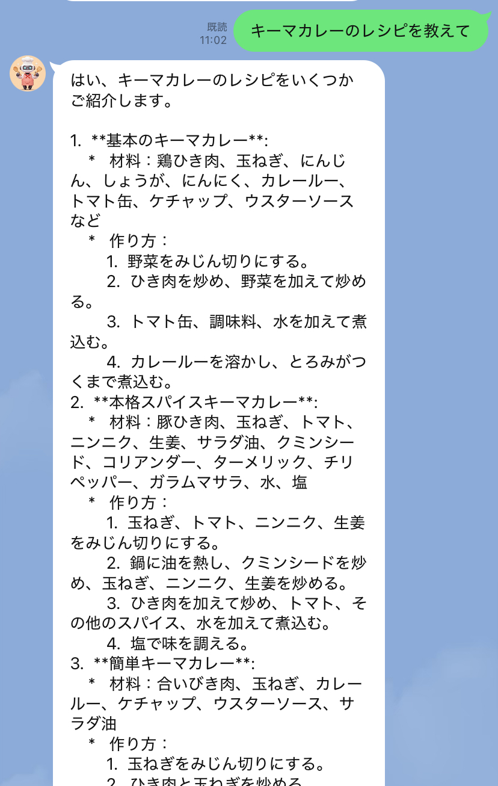

# AI エージェントベースの LINE レシピボット「ごはん何作ろう？」

## 概要

「今日のごはん何作ろう…」これは、毎日のように繰り返される主婦、主夫や一人暮らしの人の永遠の悩みです。
このリポジトリは、そんな悩みを解決するために、Google Agents Development Kit (ADK) と LINE Messaging API を使用したマルチエージェントアーキテクチャを採用した AI レシピ提案ボットの実装です。
ユーザーからのテキストや画像メッセージを受け取り、適切なレシピを生成・提案します。

## 主な技術スタック

- Python 3.13 / FastAPI：ユーザーからのリクエストを受け取り、エージェント間のメッセージを処理する Web アプリケーションフレームワーク。
- LINE Messaging API：ユーザーと Bot のインターフェース。LINE 上でのメッセージ送受信を実現。
- Vertex AI（Gemini）：ユーザーとの自然な対話やレシピ提案に使用。文脈理解と創造的な応答を生成。
- YouTube Data API：レシピに関連する動画を自動検索・取得し、提案に活用。
- Cloud Run：API ロジックを動かすサーバーレス実行環境。スケーラブルかつ運用コストを最小化。
- Agent Development Kit（ADK）：Gemini ベースの会話型エージェントの構築に使用。複数のツール連携やマルチターン対話を制御。

## 主な機能

- LINE 経由のテキスト/画像メッセージによる相談
- マルチエージェントアーキテクチャによる会話処理
- 画像分析による食材抽出（レシートの写真分析）
- YouTube からの関連レシピ動画検索
- Google での情報検索による信頼性の高いレシピ情報提供
- LINE 経由でのレスポンス送信

## ディレクトリ構成

```
main.py                         # FastAPIエントリポイント・メインアプリケーション
requirements.txt                # 依存パッケージ
Dockerfile                      # Dockerイメージビルド用

.github/                        # GitHub関連ファイル
  workflows/                    # GitHub Actions ワークフロー
    deploy.yaml                 # Cloud Runへの自動デプロイ設定

agents/                         # エージェント関連モジュール
  __init__.py
  agent_manager.py              # エージェント管理クラス
  config.py                     # エージェント設定
  prompt_manager.py             # プロンプト管理
  root_agent.py                 # ルートエージェント

prompts/                        # プロンプトテンプレート
  __init__.py
  config.yaml                   # プロンプト設定ファイル
  agents/                       # 各エージェント用プロンプト
    google_search/              # Google検索エージェント用
      main.txt                  # メインプロンプト
    image_analysis_manager/     # 画像分析エージェント用
      main.txt
    line_response_agent/        # LINE応答エージェント用
      main.txt
    recipe_manager/             # レシピ管理エージェント用
      main.txt
    registration/               # 登録エージェント用
      main.txt
    response_manager/           # レスポンス管理エージェント用
      main.txt
    root/                       # ルートエージェント用
      main.txt
    youtube_search/             # YouTube検索エージェント用
      main.txt
  core/                         # コアプロンプト
    erorr_handling.txt          # エラー処理用プロンプト
    formatting.txt              # フォーマット用プロンプト
    system.txt                  # システムプロンプト
  templates/                    # プロンプトテンプレート
    agent_base.txt              # エージェント基本テンプレート

services/                       # サービスモジュール
  __init__.py
  agent_service_impl.py         # エージェントサービス実装
  agent_service/                # エージェントサービス
    __init__.py
    constants.py                # 定数定義
    executor.py                 # 実行機能
    message_handler.py          # メッセージ処理
    responce_processor.py       # レスポンス処理
    session_manager.py          # セッション管理
  line_service/                 # LINEサービス
    __init__.py
    client.py                   # LINEクライアント
    constants.py                # LINE関連定数
    handler.py                  # LINEイベントハンドラ

tools/                          # ツール群
  __init__.py
  db_regisration.py             # データベース登録機能
  send_line_message.py          # LINE送信機能
  youtube_tools.py              # YouTube検索機能
  reccomend/                    # おすすめ機能
    __init__.py
  recipes/                      # レシピ関連ツール
    __init__.py

utils/                          # ユーティリティ
  __init__.py
  file_utils.py                 # ファイル操作ユーティリティ
  logging.py                    # ロギング機能
```

## システム構成図


## シーケンス図（マルチエージェントフロー）



## セットアップ手順

1. Python 3.13 仮想環境の作成・有効化

```bash
python3.13 -m venv venv
source venv/bin/activate
pip install -r requirements.txt
```

2. 環境変数・設定

## 開発環境のセットアップ詳細

### 前提条件

- Python 3.13 以上
- Docker（コンテナ化とデプロイのため）
- Google Cloud SDK
- LINE Developers アカウント

## 環境変数の詳細説明

以下の環境変数を設定してください。ローカル開発時は `.env` ファイルに記述することをおすすめします。

このプロジェクトでは、複数の外部 API やサービスを利用するため、様々な環境変数を設定する必要があります。
それぞれの環境変数について詳細に説明します。

### LINE API 関連設定

| 変数名                      | 必須 | 説明                                                                                        |
| --------------------------- | ---- | ------------------------------------------------------------------------------------------- |
| `LINE_CHANNEL_ACCESS_TOKEN` | ✓    | LINE Messaging API のチャネルアクセストークン。LINE Developers コンソールから取得できます。 |
| `LINE_CHANNEL_SECRET`       | ✓    | LINE Messaging API のチャネルシークレット。チャネル基本設定から取得できます。               |

### Google Cloud 設定

| 変数名            | 必須 | 説明                                                                                             |
| ----------------- | ---- | ------------------------------------------------------------------------------------------------ |
| `PROJECT_ID`      | ✓    | Google Cloud プロジェクト ID。                                                                   |
| `REGION`          | ✓    | 利用するリージョン。例: `asia-northeast1`                                                        |
| `ARTIFACT_REPO`   | ✓    | Artifact Registry のリポジトリ名。Artifact Registry でリポジトリ作成時の名前を指定してください。 |
| `ARTIFACT_REGION` | ✓    | 利用する Artifact Registry のリージョン。例: `asia-northeast1`                                   |

### API Keys

| 変数名            | 必須 | 説明                                                                          |
| ----------------- | ---- | ----------------------------------------------------------------------------- |
| `YOUTUBE_API_KEY` | ✓    | YouTube Data API v3 を使用するための API キー。料理レシピ検索機能に必要です。 |

### モデル設定

| 変数名          | 選択 | 説明                                   |
| --------------- | ---- | -------------------------------------- |
| `DEFAULT_MODEL` | ✓    | デフォルトで使用する Gemini モデル名。 |
| `SEARCH_MODEL`  | ✓    | 検索用の軽量 Gemini モデル名。         |

### データベース設定（Feature 機能のため現在無効）

| 変数名                        | 必須 | 説明                                                            |
| ----------------------------- | ---- | --------------------------------------------------------------- |
| `DB_USER`                     | -    | データベース接続用のユーザー名。                                |
| `DB_PASS`                     | -    | データベース接続用のパスワード。                                |
| `DB_NAME`                     | -    | 接続先のデータベース名。                                        |
| `DB_INSTANCE_CONNECTION_NAME` | -    | Cloud SQL 接続名。形式: `[PROJECT_ID]:[REGION]:[INSTANCE_NAME]` |

### ステップバイステップ・セットアップ

1. リポジトリのクローン

```bash
git clone <repository-url>
cd zenn-ai-hackathon
```

2. 仮想環境のセットアップ

```bash
python3 -m venv venv
source venv/bin/activate  # Linuxの場合
.\venv\Scripts\activate   # Windowsの場合
```

3. 依存パッケージのインストール

```bash
pip install -r requirements.txt
```

4. 環境変数の設定

```bash
cp .env.example .env
# .envファイルを編集して必要な値を設定
```

5. ローカル開発サーバーの起動

```bash
uvicorn main:app --reload --port 8080
```

## システムアーキテクチャ詳細

### コンポーネント間の連携



### データフロー

1. ユーザーが LINE アプリからメッセージを送信
2. LINE プラットフォームから Webhook イベントが FastAPI アプリに届く
3. FastAPI アプリはイベントを Agent Service に転送
4. Agent Service はセッションを作成し、Root エージェントにタスクを委任
5. Root エージェントはメッセージ内容を分析し、適切なサブエージェントに処理を振り分け
   - テキストメッセージ → Recipe Manager
   - 画像メッセージ → Image Analysis Manager
6. 各サブエージェントは専用ツールを使用して情報収集
7. Response Manager が最終的な応答を整形
8. LINE Messaging API を通じてユーザーに応答を送信

### モデルアーキテクチャ

このプロジェクトでは、Google Vertex AI 上の Gemini モデルファミリーを活用しています：

- **基本モデル**: `gemini-2.5-flash`

  - Root Agent と主要なエージェントに使用
  - 高品質なレシピ生成と食材理解に優れた性能

- **検索モデル**: `gemini-2.0-flash`
  - 検索や軽量処理向け
  - レスポンスタイムを最適化

## 実行例とデモ

### ユースケースシナリオ

#### シナリオ 1: テキスト入力からのレシピ提案

1. ユーザー: 例：「キーマーカレーのレシピを教えて」
2. ボット:
   - レシピの提案（材料、作り方）
   - YouTube の関連動画リンク
   - アレンジアイデアやヘルシー化のポイント

  

#### シナリオ 2: 食材画像からのレシピ提案

1. ユーザーがある食材の写真を撮影して送信
2. ボット:
   - 画像から食材を認識・リスト化
3. ユーザーから食材等のリクエストがあった場合
   - レシピの提案（材料、作り方）
   - YouTube の関連動画リンク

  

#### シナリオ 3: レシート画像からの買い物管理

1. ユーザーがスーパーのレシート画像を送信
2. ボット:
   - 購入した食材をリスト化
3. ユーザーから食材等のリクエストがあった場合
   - レシピの提案（材料、作り方）
   - YouTube の関連動画リンク

  

## 今後の機能拡張について

このプロジェクトでは、以下の機能拡張を計画しています：

1. **アレルギー・宗教的制限への対応強化**

   - ユーザーのアレルギー情報や宗教的制限（グルテンフリー、ハラールなど）を記録
   - 該当する食材や料理を自動的に除外する機能
   - Flex Message による食材チェックリスト UI の導入

2. **数日分の献立をまとめて提案**

   - バランスの取れた数日分の献立（例：3 日分の夕食メニュー＋買い物リスト）を一括提案
   - ユーザーのライフスタイル（共働き・単身など）に応じた最適化
   - Flex Message で日付別表示

3. **栄養管理機能**

   - カロリー・栄養素計算
   - 健康目標に合わせた食事プラン提案

4. **買い物リスト連携**

   - 必要な食材の買い物リスト作成
   - 近隣店舗情報との連携

5. **レシピ保存・共有機能**

   - お気に入りレシピの保存
   - SNS への共有機能

6. **レシピ動画・情報ソースの多様化**
   - 複数の料理系動画プラットフォームやレシピ API との連携
   - Gemini の Image 4 や Veo 3 を活用した料理動画の要約・難易度分類・手順の分解

## 参考リンク

- [Google Agents Development Kit](https://developers.generativeai.google/products/adk)
- [LINE Messaging API Reference](https://developers.line.biz/ja/reference/messaging-api/)
