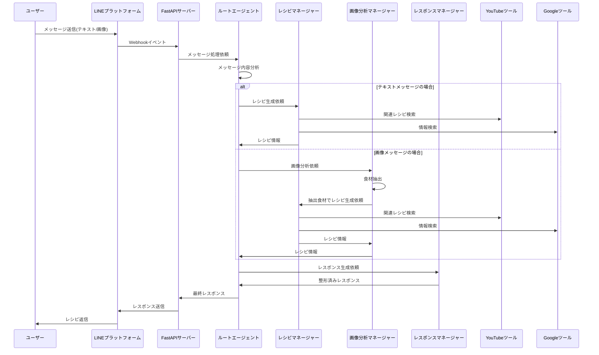
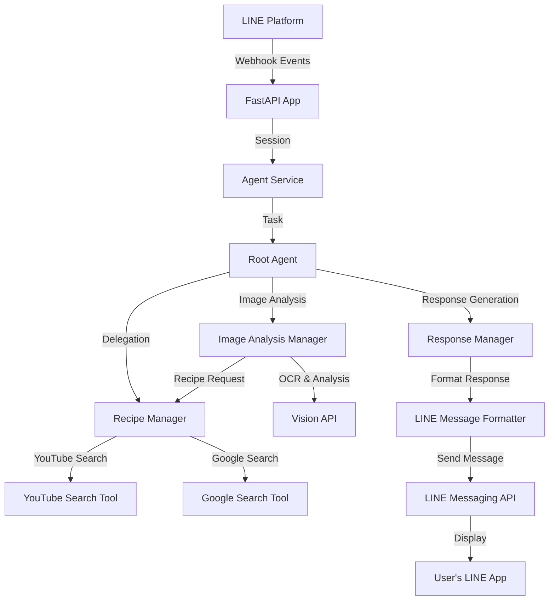

# AI エージェントベースの LINE レシピボット

## 概要

このリポジトリは、Google Agents Development Kit (ADK) と LINE Messaging API を使用したマルチエージェントアーキテクチャを採用したレシピ生成ボットの実装です。ユーザーからのテキストや画像メッセージを受け取り、適切なレシピを生成・提案します。

- Python 3.11 / FastAPI
- Google ADK (Agents Development Kit)
- Google Vertex AI Gemini
- LINE Messaging API

## 主な機能

- LINE 経由のテキスト/画像メッセージ処理
- マルチエージェントアーキテクチャによる高度な会話処理
- 画像分析による食材抽出
- レシピ自動生成と提案
- YouTube からの関連レシピ検索
- Google での情報検索
- LINE 経由でのレスポンス送信

## ディレクトリ構成

```
main.py                         # FastAPIエントリポイント・メインアプリケーション
requirements.txt                # 依存パッケージ
Dockerfile                      # Dockerイメージビルド用
deploy.sh                       # ローカルからのデプロイ用スクリプト
.env.example                    # 環境変数サンプルファイル
ハッカソン.drawio.svg           # システム設計図

.github/                        # GitHub関連ファイル
  workflows/                    # GitHub Actions ワークフロー
    deploy.yaml                 # Cloud Runへの自動デプロイ設定

agents/                         # エージェント関連モジュール
  __init__.py
  agent_manager.py              # エージェント管理クラス
  config.py                     # エージェント設定
  prompt_manager.py             # プロンプト管理
  root_agent.py                 # ルートエージェント

prompts/                        # プロンプトテンプレート
  __init__.py
  config.yaml                   # プロンプト設定ファイル
  agents/                       # 各エージェント用プロンプト
    google_search/              # Google検索エージェント用
      main.txt                  # メインプロンプト
    image_analysis_manager/     # 画像分析エージェント用
      main.txt
    line_response_agent/        # LINE応答エージェント用
      main.txt
    recipe_manager/             # レシピ管理エージェント用
      main.txt
    registration/               # 登録エージェント用
      main.txt
    response_manager/           # レスポンス管理エージェント用
      main.txt
    root/                       # ルートエージェント用
      main.txt
    youtube_search/             # YouTube検索エージェント用
      main.txt
  core/                         # コアプロンプト
    erorr_handling.txt          # エラー処理用プロンプト
    formatting.txt              # フォーマット用プロンプト
    system.txt                  # システムプロンプト
  templates/                    # プロンプトテンプレート
    agent_base.txt              # エージェント基本テンプレート

services/                       # サービスモジュール
  __init__.py
  agent_service_impl.py         # エージェントサービス実装
  agent_service/                # エージェントサービス
    __init__.py
    constants.py                # 定数定義
    executor.py                 # 実行機能
    message_handler.py          # メッセージ処理
    responce_processor.py       # レスポンス処理
    session_manager.py          # セッション管理
  line_service/                 # LINEサービス
    __init__.py
    client.py                   # LINEクライアント
    constants.py                # LINE関連定数
    handler.py                  # LINEイベントハンドラ

tools/                          # ツール群
  __init__.py
  db_regisration.py             # データベース登録機能
  send_line_message.py          # LINE送信機能
  youtube_tools.py               # YouTube検索機能（ファイル名はtypo）
  reccomend/                    # おすすめ機能
    __init__.py
  recipes/                      # レシピ関連ツール
    __init__.py

utils/                          # ユーティリティ
  __init__.py
  file_utils.py                 # ファイル操作ユーティリティ
  logging.py                    # ロギング機能
```

## シーケンス図（マルチエージェントフロー）



## セットアップ手順

1. Python 3.11 仮想環境の作成・有効化

```bash
python3.11 -m venv venv
source venv/bin/activate
pip install -r requirements.txt
```

2. 環境変数・設定

以下の環境変数を設定してください。ローカル開発時は `.env` ファイルに記述することをおすすめします。
リポジトリには `.env.example` ファイルが含まれていますので、コピーしてご利用ください。

```bash
cp .env.example .env
# .envファイルを編集して必要な値を設定
```

| 変数名                         | 説明                                                                 |
| ------------------------------ | -------------------------------------------------------------------- |
| LINE_CHANNEL_ACCESS_TOKEN      | LINE Messaging API のチャネルアクセストークン                        |
| LINE_CHANNEL_SECRET            | LINE Messaging API のチャネルシークレット                            |
| GOOGLE_APPLICATION_CREDENTIALS | Google Cloud 認証用 JSON ファイルのパス                              |
| GCS_BUCKET_NAME                | 画像を保存する Google Cloud Storage バケット名                       |
| VERTEX_AI_PROJECT_ID           | Vertex AI（Gemini）を利用する GCP プロジェクト ID                    |
| VERTEX_AI_LOCATION             | Vertex AI（Gemini）を利用するリージョン                              |
| DB_USER                        | データベースユーザー名                                               |
| DB_PASS                        | データベースパスワード                                               |
| DB_NAME                        | データベース名                                                       |
| DB_INSTANCE_CONNECTION_NAME    | Cloud SQL インスタンス接続名（プロジェクト:リージョン:インスタンス） |
| DEFAULT_MODEL                  | 使用するデフォルトの Gemini モデル（オプション）                     |
| SEARCH_MODEL                   | 検索に使用する Gemini モデル（オプション）                           |

## 環境変数の詳細説明

このプロジェクトでは、複数の外部 API やサービスを利用するため、様々な環境変数を設定する必要があります。それぞれの環境変数について詳細に説明します。

### LINE API 関連設定

| 変数名                      | 必須 | 説明                                                                                        |
| --------------------------- | ---- | ------------------------------------------------------------------------------------------- |
| `LINE_CHANNEL_ACCESS_TOKEN` | ✓    | LINE Messaging API のチャネルアクセストークン。LINE Developers コンソールから取得できます。 |
| `LINE_CHANNEL_SECRET`       | ✓    | LINE Messaging API のチャネルシークレット。チャネル基本設定から取得できます。               |

### Google Cloud 設定

| 変数名                           | 必須 | 説明                                                                                                        |
| -------------------------------- | ---- | ----------------------------------------------------------------------------------------------------------- |
| `GOOGLE_APPLICATION_CREDENTIALS` | ✓    | Google Cloud 認証用 JSON ファイルの絶対パス。GCP コンソールからサービスアカウントキーを生成して取得します。 |
| `VERTEX_AI_PROJECT_ID`           | ✓    | Vertex AI API を使用する GCP プロジェクトの ID。                                                            |
| `VERTEX_AI_LOCATION`             | ✓    | Vertex AI API を使用するリージョン。例: `asia-northeast1`                                                   |
| `GCS_BUCKET_NAME`                | ✓    | 画像を保存する Google Cloud Storage バケット名。あらかじめ作成しておく必要があります。                      |

### データベース設定

| 変数名                        | 必須 | 説明                                                            |
| ----------------------------- | ---- | --------------------------------------------------------------- |
| `DB_USER`                     | ✓    | データベース接続用のユーザー名。                                |
| `DB_PASS`                     | ✓    | データベース接続用のパスワード。                                |
| `DB_NAME`                     | ✓    | 接続先のデータベース名。                                        |
| `DB_INSTANCE_CONNECTION_NAME` | ✓    | Cloud SQL 接続名。形式: `[PROJECT_ID]:[REGION]:[INSTANCE_NAME]` |

### API Keys

| 変数名            | 必須 | 説明                                                                          |
| ----------------- | ---- | ----------------------------------------------------------------------------- |
| `YOUTUBE_API_KEY` | ✓    | YouTube Data API v3 を使用するための API キー。料理レシピ検索機能に必要です。 |

### モデル設定

| 変数名          | 選択 | 説明                                                                                     |
| --------------- | ---- | ---------------------------------------------------------------------------------------- |
| `DEFAULT_MODEL` | -    | デフォルトで使用する Gemini モデル名。未設定の場合は `gemini-2.5-flash` が使用されます。 |
| `SEARCH_MODEL`  | -    | 検索用の軽量 Gemini モデル名。未設定の場合は `gemini-2.0-flash` が使用されます。         |

## トラブルシューティング

### よくある問題と解決方法

| 問題                                                        | 原因                                                                | 解決方法                                                                                        |
| ----------------------------------------------------------- | ------------------------------------------------------------------- | ----------------------------------------------------------------------------------------------- |
| `LINE_CHANNEL_ACCESS_TOKEN environment variable is not set` | LINE 関連の環境変数が設定されていない                               | `.env`ファイルに LINE チャネルアクセストークンが正しく設定されているか確認してください。        |
| `YOUTUBE_API_KEY environment variable is not set`           | YouTube API 用の環境変数が設定されていない                          | `.env`ファイルに YouTube API キーが設定されているか確認してください。                           |
| `DBエンジンの作成に失敗しました`                            | データベース接続情報が不正、または Cloud SQL 接続が設定されていない | データベース接続情報を確認し、Cloud Run から Cloud SQL への接続設定が正しいか確認してください。 |
| `gcloud: command not found`                                 | Google Cloud SDK がインストールされていない                         | [Google Cloud SDK](https://cloud.google.com/sdk/docs/install)をインストールしてください。       |

### よくあるエラーコードの説明

| エラーコード                | 意味                           | 対処法                                                                                       |
| --------------------------- | ------------------------------ | -------------------------------------------------------------------------------------------- |
| `403 Forbidden`             | API 呼び出しに対する権限がない | API キーの権限設定を確認してください。                                                       |
| `429 Too Many Requests`     | API 制限に達した               | API の利用制限を確認し、必要に応じて制限の緩和や使用量の削減を検討してください。             |
| `500 Internal Server Error` | サーバー側エラー               | ログを確認し、エラーの詳細を把握してください。一時的なエラーの場合は再試行してみてください。 |

## 開発環境のセットアップ詳細

### 前提条件

- Python 3.11 以上
- Node.js 14 以上（LINE ボットメッセージングのため）
- Docker（コンテナ化とデプロイのため）
- Google Cloud SDK
- LINE Developers アカウント

### ステップバイステップ・セットアップ

1. リポジトリのクローン

```bash
git clone <repository-url>
cd zenn-ai-hackathon
```

2. 仮想環境のセットアップ

```bash
python3 -m venv venv
source venv/bin/activate  # Linuxの場合
# または
.\venv\Scripts\activate   # Windowsの場合
```

3. 依存パッケージのインストール

```bash
pip install -r requirements.txt
npm install -g @line/line-bot-mcp-server
```

4. 環境変数の設定

```bash
cp .env.example .env
# テキストエディタで.envを開き、必要な値を設定
```

5. Google サービスアカウントの認証

```bash
# サービスアカウントキーJSONファイルをダウンロードし、安全な場所に保存
export GOOGLE_APPLICATION_CREDENTIALS="/path/to/your-project-credentials.json"
```

6. ローカル開発サーバーの起動

```bash
uvicorn main:app --reload --port 8080
```

7. ngrok を使用したローカル開発環境のトンネリング（オプション）

```bash
ngrok http 8080
# 表示されるURLをLINE DevelopersコンソールのWebhook URLに設定
```

## システムアーキテクチャ詳細

### コンポーネント間の連携



### データフロー

1. ユーザーが LINE アプリからメッセージを送信
2. LINE プラットフォームから Webhook イベントが FastAPI アプリに届く
3. FastAPI アプリはイベントを Agent Service に転送
4. Agent Service はセッションを作成/復元し、Root エージェントにタスクを委任
5. Root エージェントはメッセージ内容を分析し、適切なサブエージェントに処理を振り分け
   - テキストメッセージ → Recipe Manager
   - 画像メッセージ → Image Analysis Manager
6. 各サブエージェントは専用ツールを使用して情報収集
7. Response Manager が最終的な応答を整形
8. LINE Messaging API を通じてユーザーに応答を送信

### モデルアーキテクチャ

このプロジェクトでは、Google Vertex AI 上の Gemini モデルファミリーを活用しています：

- **基本モデル**: `gemini-2.5-flash`

  - Root Agent と主要なエージェントに使用
  - 高品質なレシピ生成と食材理解に優れた性能

- **検索モデル**: `gemini-2.0-flash`
  - 検索や軽量処理向け
  - レスポンスタイムを最適化

## 実行例とデモ

### ユースケースシナリオ

#### シナリオ 1: テキスト入力からのレシピ提案

1. ユーザー: 「今日の夕食におすすめの簡単な魚料理を教えて」
2. ボット:
   - レシピの提案（材料、作り方）
   - YouTube の関連動画リンク
   - アレンジアイデアやヘルシー化のポイント

#### シナリオ 2: 食材画像からのレシピ提案

1. ユーザーが冷蔵庫にある食材の写真を撮影して送信
2. ボット:
   - 画像から食材を認識・リスト化
   - 見つかった食材を使ったレシピ提案
   - 足りない食材の提案

#### シナリオ 3: レシート画像からの買い物管理

1. ユーザーがスーパーのレシート画像を送信
2. ボット:
   - 購入した食材をリスト化
   - 保存方法のアドバイス
   - 食材を組み合わせたレシピのアイデアを提案

### デモ動画

デモ動画は [こちらのリンク](#) から閲覧できます。
※実際のデモリンクに更新してください

### スクリーンショット

<div align="center">
  
  
</div>
※実際のスクリーンショット画像を追加してください

## 今後の開発予定

このプロジェクトでは、以下の機能拡張を計画しています：

1. **ユーザープロファイル機能**

   - 食事の好み・アレルギー情報の保存
   - パーソナライズされたレシピ提案

2. **栄養管理機能**

   - カロリー・栄養素計算
   - 健康目標に合わせた食事プラン提案

3. **買い物リスト連携**

   - 必要な食材の買い物リスト作成
   - 近隣店舗情報との連携

4. **レシピ保存・共有機能**

   - お気に入りレシピの保存
   - SNS への共有機能

5. **言語モデルの拡張**
   - より詳細な料理説明
   - 調理テクニックの詳細なアドバイス

## 技術的負債と改善点

現在認識している技術的負債と改善ポイントは以下の通りです：

1. **エラーハンドリングの強化**

   - より詳細なエラーログと回復メカニズム
   - ユーザーへのわかりやすいエラー表示

2. **パフォーマンス最適化**

   - API 呼び出しの並列処理
   - キャッシュ導入による応答時間の短縮

3. **テストカバレッジ向上**

   - ユニットテストの追加
   - 統合テスト・E2E テストの追加

4. **コードリファクタリング**
   - 一部の重複コードの整理
   - より細かいモジュール分割

## 参考リンク

- [Google Agents Development Kit](https://developers.generativeai.google/products/adk)
- [LINE Messaging API Reference](https://developers.line.biz/ja/reference/messaging-api/)
- [Vertex AI Gemini API](https://cloud.google.com/vertex-ai/docs/generative-ai/model-reference/gemini)
- [Cloud Run Documentation](https://cloud.google.com/run/docs)
